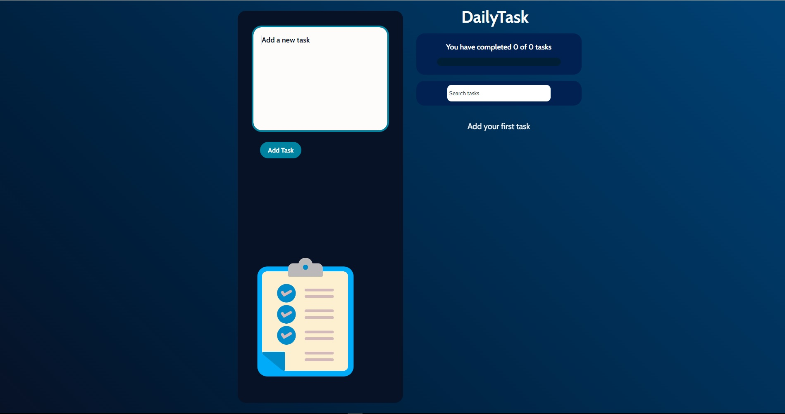
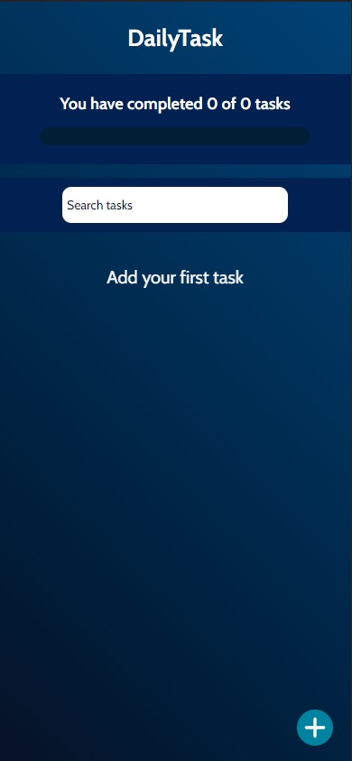

> # **DAILY TASKS APP 📝**

> ## **DESCRIPCION**

-    Este proyecto se realizó tomando _`El Curso de ReactJS`_ de `PLATZI`.
-    Se usó createContext para un manejo de estado global.
-    Para los iconos se usó react-icons.

 

---

 

> ## **FUNCIONALIDAD**

-    Crea tus tareas diarias.
-    Podrás marcar para completar tarea y desmarcar si lo deseas.
-    Elimina la tarea que desees.

 

---

 

> ## **VISTAS**

   

 

 

   

